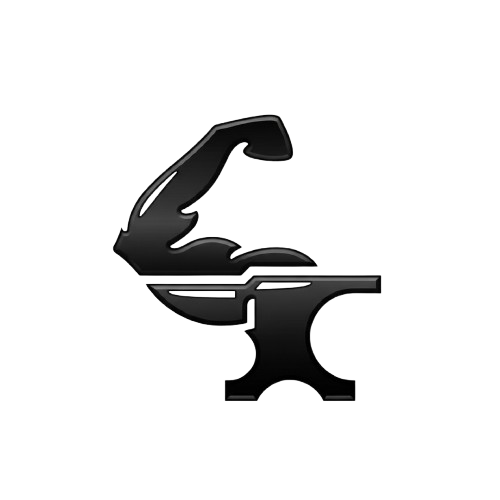
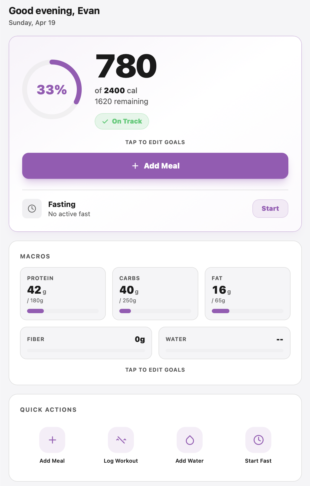
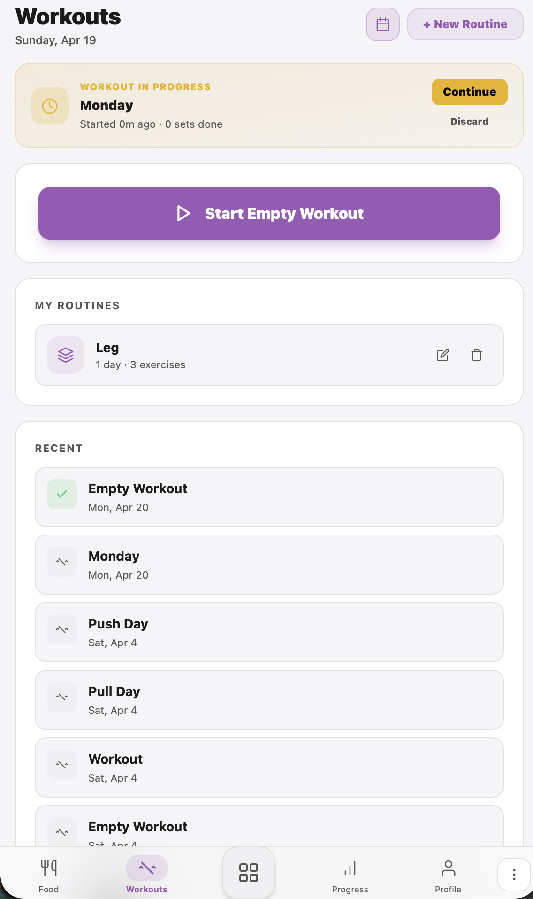
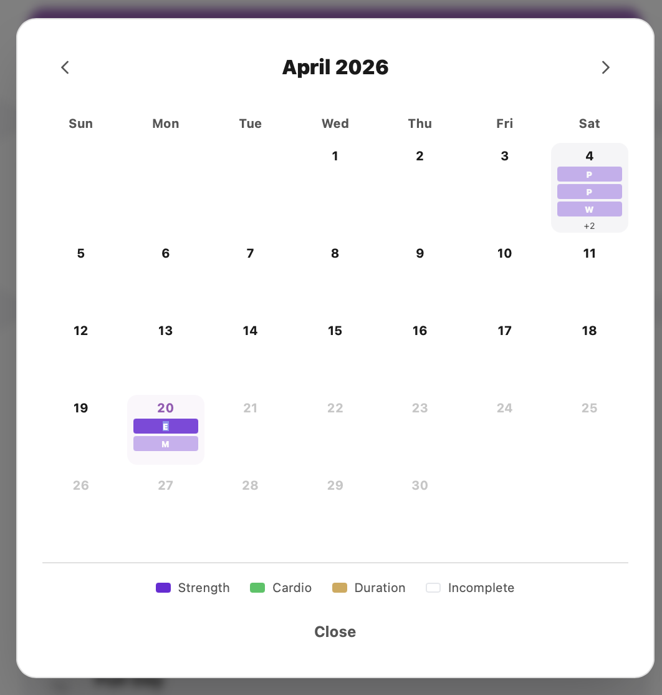
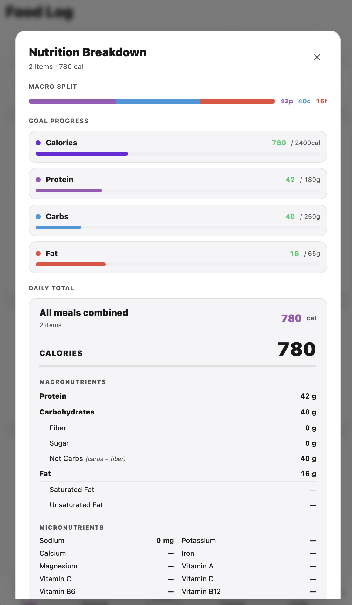
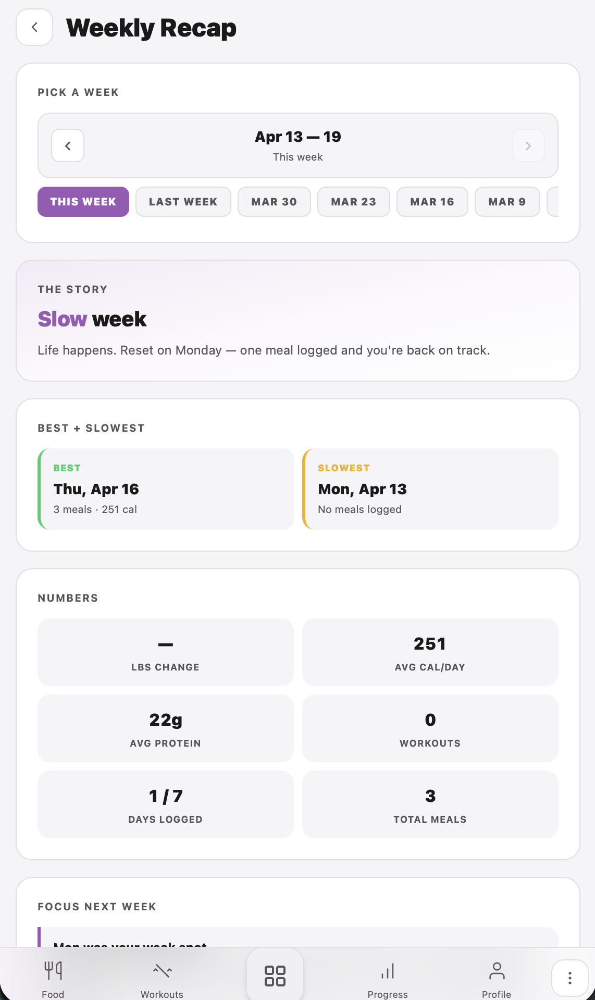

<div align="center">



# FORGED

### Training. Nutrition. Transformation. One place.

A full-stack fitness tracking platform built for people who want real data on their training and real progress in their body. Log workouts, track macros, measure progress, and build the body you are working toward.

### **[ ENTER THE GYM → ](https://forgedgyms.com)**

</div>

---

## Tech Stack

<div align="center">


&nbsp;&nbsp;

&nbsp;&nbsp;

&nbsp;&nbsp;

&nbsp;&nbsp;

&nbsp;&nbsp;

&nbsp;&nbsp;

&nbsp;&nbsp;

&nbsp;&nbsp;

&nbsp;&nbsp;


</div>

---

## Overview

FORGED is a self-hosted fitness tracking application designed around three core pillars: **training**, **nutrition**, and **transformation**. It replaces the need for multiple disconnected apps (MyFitnessPal for food, Strong for workouts, Progress for photos) with a single integrated system that captures the full picture of your fitness journey.

The app was built from the ground up as a personal project to solve frustrations with existing fitness trackers: cluttered interfaces, paywalls on basic features, poor data portability, and ads everywhere. FORGED is ad-free, built around a clean premium design system (FORGE UI), and runs on infrastructure you control.

---

## Screenshots

<div align="center">

### Dashboard
Your daily command center. Today's workout, macros remaining, streak tracking, weight trend, and the next action you should take. No noise.



### Workout Logger
Log sets, reps, and weights with minimal friction. Live volume calculations, PR detection, and automatic rest timers. Every rep counts.



### Routines
Build, save, and reuse training splits. Push/Pull/Legs, Upper/Lower, custom routines, and everything in between. Follow your plan.



### Food Log
Barcode scanning, macro tracking, custom recipes, and intermittent fasting built in. Know what you eat.



### Weekly Recap
Your transformation in data. Progress photos, streak tracking, weight trends, and week-over-week comparisons. See the change.



</div>

---

## Features

### Training
- **Workout logging** with sets, reps, weight, RPE, and rest timers
- **PR detection** with automatic personal record tracking across all lifts
- **Volume tracking** calculated live as you train
- **Exercise library** with search, categories, and equipment filters
- **Routine builder** for saving and reusing training programs
- **Cardio tracking** with duration, distance, and heart rate support
- **Session history** with the ability to see your last performance on any exercise

### Nutrition
- **Barcode scanning** for instant food logging
- **Custom recipes** you can save and reuse
- **Macro targets** that adapt based on your training load
- **Meal photo capture** for visual food journaling
- **Intermittent fasting** tracker with configurable windows (16:8, 18:6, OMAD)
- **USDA food database** integration with thousands of foods

### Transformation
- **Weekly recaps** summarizing your training and nutrition
- **Progress photos** with privacy lock and side-by-side comparison
- **Measurements** tracking for waist, chest, arms, thighs, and more
- **Weight history** with trend analysis and goal tracking
- **Streak tracking** for consistency motivation

### Platform
- **Responsive design** that works on mobile, tablet, and desktop
- **Dark mode** first, with multiple theme support planned
- **Offline-aware** with graceful degradation
- **Self-hosted** for complete data ownership

---

## Architecture Overview

### Frontend
Built with **React 18** and **TypeScript 5**, using **Vite** as the build tool and dev server. **Tailwind CSS** handles all styling with utility classes. **React Router** manages client-side routing. Motion graphics use **Lottie**, and the landing page features **Three.js** animated backgrounds. All HTTP communication uses the native **Fetch API** (no Axios, by design).

### Backend
Powered by **.NET 8** with ASP.NET Core Web API. Database access flows through **Entity Framework Core** with **Npgsql** for PostgreSQL connectivity. Authentication is stateless using **JWT**, with **BCrypt** handling password hashing at a work factor of 12.

### Database
**PostgreSQL 16** runs as the single source of truth, with UUID primary keys throughout. The schema is organized around a `public` schema for user-generated data and a planned `reference` schema for static reference data like the USDA food database and exercise catalog.

### Infrastructure
**Docker Compose** orchestrates the three main containers: frontend (Nginx serving a built Vite bundle), backend (.NET API), and Postgres database. **Nginx** acts as the reverse proxy in front of the backend. **Cloudflare Tunnel** handles secure public access without exposing server ports, pointing `forgedgyms.com` traffic at the Proxmox VM that hosts everything.

### Design System
**FORGE UI** is the custom design system used throughout FORGED. Its principles are *Borderless. Premium. Minimal.* The palette is built on Indigo Gold (`#7c3aed` primary, `#D4A853` accent), with a triple font system of Archivo for display, Space Grotesk for UI, and Nunito Sans for body copy. The system intentionally avoids cards and borders, relying on spacing alone for visual hierarchy.

---

## Project Structure

```
forged/
├── frontend/                    # React + TypeScript + Vite app
│   ├── public/
│   │   ├── forgedlogo.png      # Main logo asset
│   │   ├── favicon.png         # Browser tab icon
│   │   ├── og-image.png        # Social link preview card
│   │   ├── animations/         # Lottie JSON files
│   │   └── screenshots/        # Product screenshots for marketing
│   ├── src/
│   │   ├── pages/              # Route-level components
│   │   │   ├── Login.tsx       # Landing page + auth
│   │   │   ├── Dashboard.tsx
│   │   │   ├── Workout.tsx
│   │   │   ├── FoodLog.tsx
│   │   │   └── Recap.tsx
│   │   ├── components/         # Reusable UI primitives
│   │   ├── hooks/              # Custom React hooks
│   │   │   └── api.ts          # Native fetch API client
│   │   └── main.tsx
│   ├── nginx.conf              # Production nginx config
│   ├── Dockerfile
│   ├── package.json
│   └── vite.config.ts
│
├── backend/                     # .NET 8 Web API
│   ├── Controllers/            # API endpoints
│   ├── Models/                 # Entity and DTO classes
│   ├── Services/               # Business logic layer
│   ├── Data/                   # EF Core DbContext
│   ├── Program.cs              # App entry and DI setup
│   └── Dockerfile
│
├── scripts/
│   └── init.sql                # Initial database schema
│
├── docker-compose.yml          # Orchestrates frontend + backend + postgres
├── .gitignore
└── README.md
```

---

## Getting Started

### Prerequisites

You need these installed before you start:

- **Docker** and **Docker Compose** v2+
- **Node.js** 20+ and **npm** (for frontend dev outside Docker)
- **.NET 8 SDK** (for backend dev outside Docker)
- **PostgreSQL client** (optional, for direct DB access with `psql`)
- **Git**

### Clone and setup

```bash
git clone https://github.com/Brago475/Forged.git
cd Forged
```

### Environment variables

Create a `.env` file at the repo root. See `.env.example` for the template.

```bash
# Database
POSTGRES_DB=forged
POSTGRES_USER=forged_user
POSTGRES_PASSWORD=your_secure_password_here

# Backend
ASPNETCORE_ENVIRONMENT=Development
JWT_SECRET=your_long_random_secret_here
JWT_ISSUER=forgedgyms.com

# Frontend
VITE_API_URL=http://localhost:5000
```

### Run with Docker Compose

The fastest way to get everything running:

```bash
docker compose up --build -d
```

This spins up three containers:
- `forged-postgres` on port 5432
- `forged-api` (.NET backend) on port 5000
- `forged-frontend` (nginx serving the Vite build) on port 3001

On first boot, Postgres will run `scripts/init.sql` automatically to create the schema.

Visit **http://localhost:3001** to see the app.

### Run frontend in dev mode (hot reload)

```bash
cd frontend
npm install
npm run dev
```

Dev server runs on `http://localhost:5173` with hot module replacement.

### Run backend in dev mode

```bash
cd backend
dotnet restore
dotnet run
```

Backend runs on `http://localhost:5000`. Swagger docs at `http://localhost:5000/swagger`.

---

## Database

### Schema overview

The initial schema is defined in `scripts/init.sql`. Key tables:

- `users` - account info, physical stats, goals
- `weight_entries` - daily weight logs with UNIQUE constraint per user per date
- `workout_logs` - gym sessions with duration, notes, plan type
- `exercise_logs` - individual exercises within a workout
- `meal_entries` - food consumption records
- `measurements` - body measurements over time
- `progress_photos` - linked to timestamps with privacy flags

All tables use UUID primary keys (`gen_random_uuid()`) and foreign key cascades on user deletion.

### Connecting directly

```bash
docker exec -it forged-postgres psql -U forged_user -d forged
```

### Resetting the database

```bash
docker compose down -v     # removes volumes too
docker compose up -d       # runs init.sql fresh
```

---

## Deployment

FORGED is deployed on a Proxmox VM with public access via Cloudflare Tunnel. No ports are exposed directly to the internet.

### Deploy command (Proxmox server)

```bash
cd ~/forged \
  && git pull \
  && docker compose up --build -d \
  && docker compose restart forged-nginx \
  && sudo systemctl restart cloudflared
```

### Cloudflare configuration

Public traffic flow:

```
User → forgedgyms.com → Cloudflare Edge → Cloudflare Tunnel → Server:3001 (nginx)
                                                                   ├─ frontend container
                                                                   └─ backend container (via nginx proxy_pass)
```

The tunnel config lives at `/etc/cloudflared/config.yml` on the server and routes `forgedgyms.com` to `http://localhost:3001`.

### Cache invalidation

Cloudflare aggressively caches built assets. After every deploy:

1. Go to Cloudflare dashboard → Caching → Configuration
2. Click **Purge Everything**
3. Hard refresh the browser (`Cmd+Shift+R` on Mac, `Ctrl+Shift+R` on Windows)

---

## Design System (FORGE UI)

FORGED uses a custom design system called **FORGE UI**, built on three principles:

> **Borderless. Premium. Minimal.**

### Color palette

| Token | Hex | Usage |
|---|---|---|
| Primary | `#7c3aed` | Main CTAs, active states, primary accents |
| Primary Dark | `#5b21b6` | Hover/active variants |
| Accent | `#D4A853` | Secondary highlights, nutrition category |
| Danger | `#991B1B` | Errors, destructive actions |
| Dark Base | `#0f0a1f` | Primary background (dark mode) |
| Off-White | `#FAFAF8` | Primary background (light mode) |

### Typography

- **Archivo** - headlines and wordmarks (900 weight for FORGED brand)
- **Space Grotesk** - UI text, buttons, labels
- **Nunito Sans** - long-form body copy

### Motion

- Page transitions: 100ms fade-out, 300ms skeleton bridge, 70ms per-element stagger
- Button active state: `scale(0.97)` for tactile feedback
- Tab indicators: 350ms cubic-bezier slide
- Progress bars: 3px height, smooth fill
- Icons: Lucide (outline inactive, filled active)

---

## Security

- Passwords are hashed with **BCrypt** (work factor 12)
- Authentication uses **JWT** with short-lived access tokens
- All traffic runs over **HTTPS** via Cloudflare
- No ports exposed directly to the internet (Cloudflare Tunnel only)
- Secrets live in `.env` files, never committed to git
- `node_modules/`, build outputs, and `.env` are all gitignored
- Dependencies are audited regularly; axios was notably avoided after the March 2026 supply-chain compromise

---

## License

Copyright © 2026 TCW Studio (The Creative Works Studio)

All rights reserved. This repository is public for portfolio and reference purposes. Code is not licensed for reuse or redistribution without explicit permission.

---

## Author

**James W. Mardi** (Evan Brago)

Computer Science MS Candidate at Kean University (expected May 2027). Building under **TCW Studio** (The Creative Works Studio).

GitHub: [@Brago475](https://github.com/Brago475)

---

<div align="center">

### **[ forgedgyms.com ](https://forgedgyms.com)**

Built with discipline. Deployed with care.

</div>